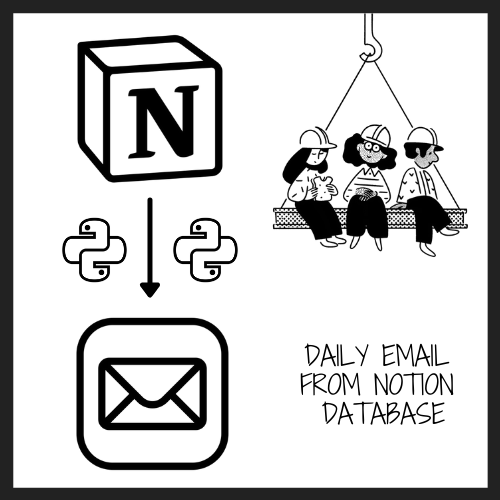
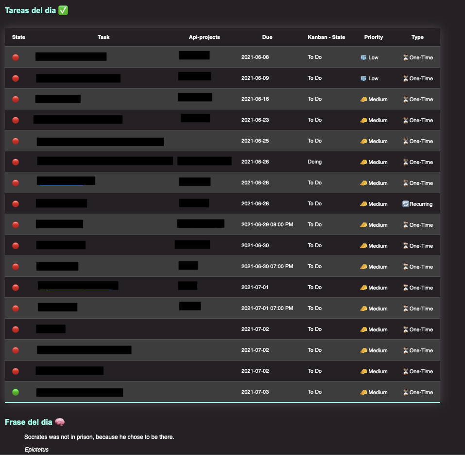
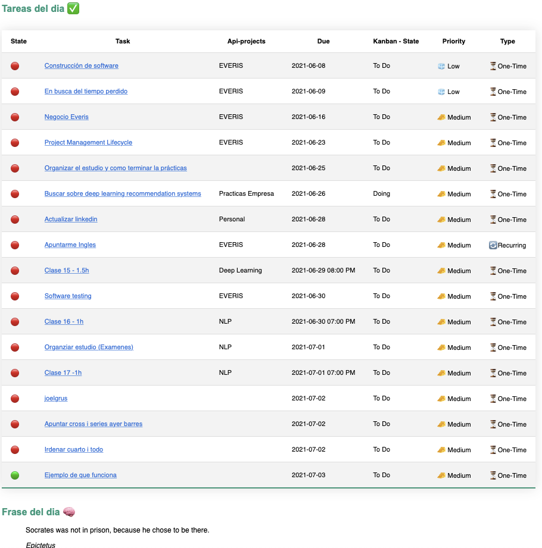

    
<h2 style="
    text-align: center;
    font-weight:200;
    font-size: 28px;
    text-transform: uppercase;
">Daily e-mail from notion database</h2>
<p align="center">
    
</p>


[](https://opensource.org/licenses/MIT)
[](https://www.linkedin.com/in/carles-serra-vendrell/)


## Table of contents
- [About The Project](#about-the-project)
- [Configuration](#configuration)
  * [Installing dependencies 🛠](#installing-dependencies-🛠)
  * [Notion ⚙️](#notion-⚙️)
  * [Tokens secret file 🔐](#tokens-secret-file-🔐)
  * [Github action 🔄](#github-action-🔄)
- [Usage and personalization](#usage-and-personalization)
  * [Filter and sort queries 🔎](#filter-and-sort-queries-🔎)
  * [Email template personalization 🎨](#email-template-personalization-🎨)
- [Contributing](#contributing)
- [References](#references)

## About The Project
I ❤️ [Notion](https://www.notion.so)! I use it daily to organize my whole life, take notes, my reading list and a ton of other things.

My routine is simple. I check every morning my daily to-do's in Notion. However, I would always like to have a daily email every morning with all the tasks. I think it would help me to focus more and have a mental map of the day.  Moreover, it would avoid getting distracted in lower priority tasks.

With the new official Notion API, this idea is finally a reality in my life.
This project retrieves the data from a database where I organized all my tasks, generates a simple HTML template like the ones we see in the images below and sends an email using Github actions. Simple and effective.

<span>
    <p align="center">
        
        
    <p>
</span>

## Configuration

### Installing dependencies 🛠
Update pip:
```sh
python -m pip install --upgrade pip
```

Install dependencies via pip:
```sh
pip install requests python-dateutil
```
### Notion ⚙️
Follow the official Notion api getting started guide [here](https://developers.notion.com/docs) to learn how to set up notion integrations.

⚠️  For having access to relation database columns/properties, you must share the integration in the related database.

### Tokens secret file 🔐
Generated ```dailyEmail/tokens.py``` file with ```SECRET``` dictionary with the following properties:

* **notion_test_token:** Notion integration token secret key.
* **database_id:** Notion database id, extracted from the database notion url.
    Example:
    ``` 
    https://www.notion.so/myworkspace/a8aec43384f447ed84390e8e42c2e089?v=...
                                    |--------- Database ID --------|
    ```
* **gmail_password:** The password of ```email_from``` email. 
* **email_from:** Email address is going to send the email.
* **email_to:** Email address is going to receive email.

Example:
```python
SECRETS = {
    'notion_test_token': '',
    'database_id': '',
    'gmail_password': '',
    'email_from': '',
    'email_to': ''
}
```

⚠️ Make sure to include this file in the ```.gitignore``` to avoid upload sensible information to the repository.

### Github action 🔄
1. In local, encode the content of the ```tokens.py``` using **base64**:
    ```sh
    base64 ./dailyEmail/tokens.py
    ```
2. Copy and paste the encode output into your GitHub secrets. Use the name ```$TOKENS_PY_FILE```.
3. The github action runs at 5:30 AM every day. Change the cron schedule expressions if you want it. [Web for cron schedule expressions calculation](https://crontab.guru/#30_5_*_*_*)
    ```sh
    schedule:
        - cron:  '30 5 * * *'
    ```

## Usage and personalization

### Filter and sort queries 🔎
For changing the query filtering or sorting, just modify the query ```dict``` following the [api reference](https://developers.notion.com/reference/post-database-query) indications.

If no filtering or sorting is need it, just delete the query ```dict``` from the ```dailyEmail/todays-schedule-email.py``` script.

Example:
```python
query = {
    "filter": {
        "and": [
            {
                "property": "Done",
                "checkbox": {
                    "equals": False
                }
            },
            {
                "property": "Due",
                "date": {
                    "before": tomorrow
                }
            }
        ]
    },
    "sorts": [
        {
            "property": "Due",
            "direction": "ascending"
        },
        {
            "property": "State",
            "direction": "descending"
        }
    ]
}
```

### Email template personalization 🎨

***Table information:***
By default the email table will print all the columns/properties from the notion database. If we need just to print some of the columns set the ```dbProperties``` list with the name of the columns we want to print.

Be aware of the order, because the ```dbProperties``` list sequence will be use. We could re-order the list if we want.
```python
dbProperties = ['State', 'Task', 'Api-projects', 'Due', 'Kanban - State', 'Priority', 'Type']
```

***Style:***
If we want to change the style of the table you could modify the style string from ```dailyEmail/html.py```. In my case, I use the following tutorial as a  [reference](https://dev.to/dcodeyt/creating-beautiful-html-tables-with-css-428l)


## Contributing
All contributions are welcome👌🏼. 

Just send a PR or open an issue💡.

Also, contact me directly📲!
## References

* **My project and task managment system (Thomas Frank):** https://www.youtube.com/watch?v=tjAWsuz5MdM

* **Good video explaining Notion Api:** https://www.youtube.com/watch?v=sdn1HgxLwEg

* **Encode Tokens secrets:** https://stackoverflow.com/questions/67964110/how-to-access-secrets-when-using-flutter-web-with-github-actions/67998780#67998780

* **Table style:** https://dev.to/dcodeyt/creating-beautiful-html-tables-with-css-428l

* **Crontab guru:** https://crontab.guru/